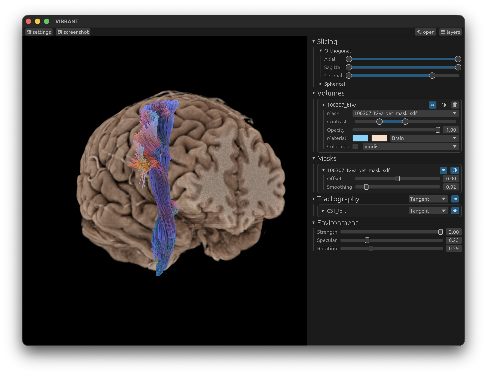
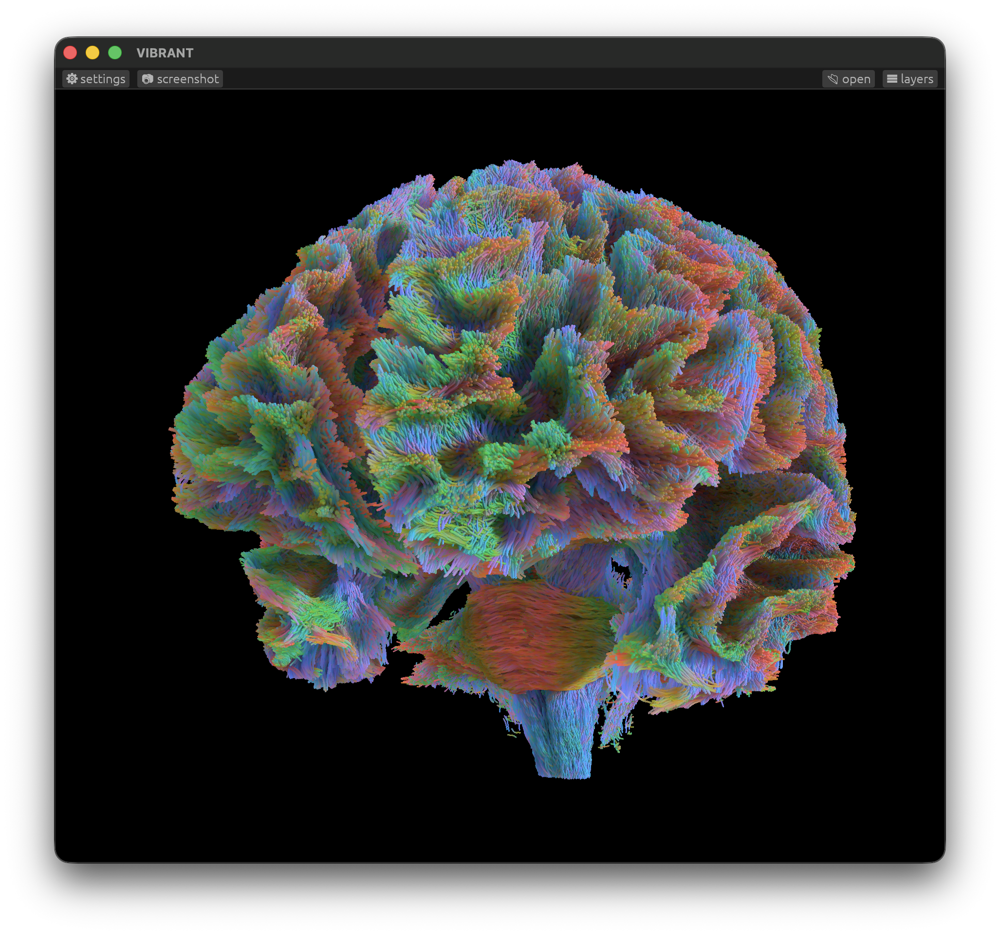
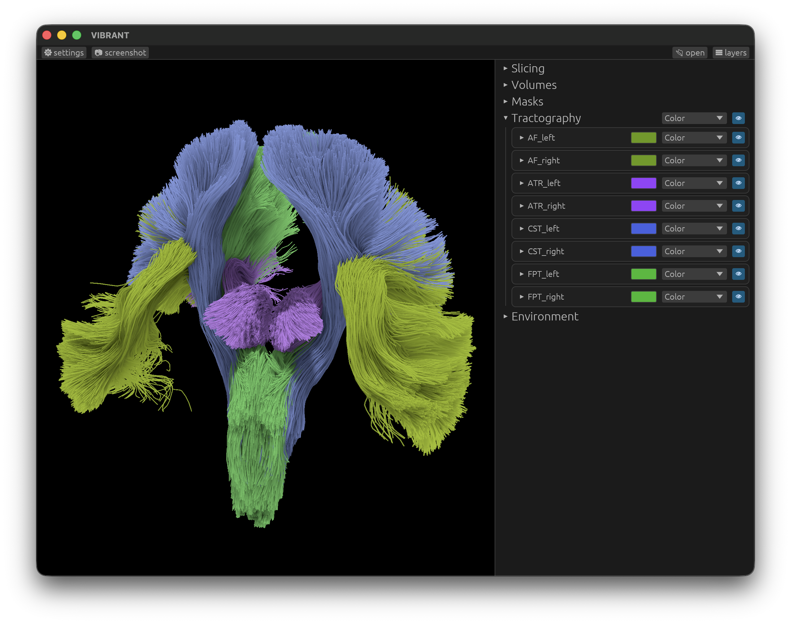
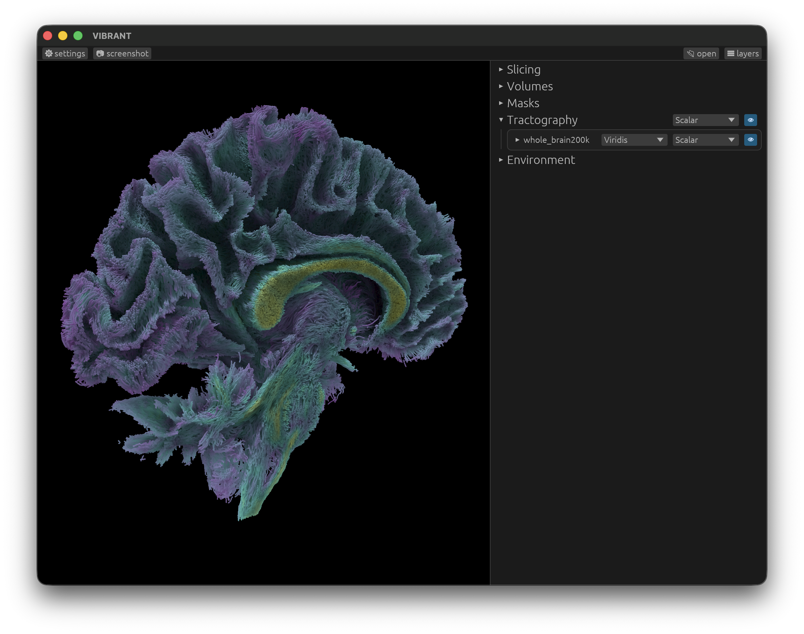
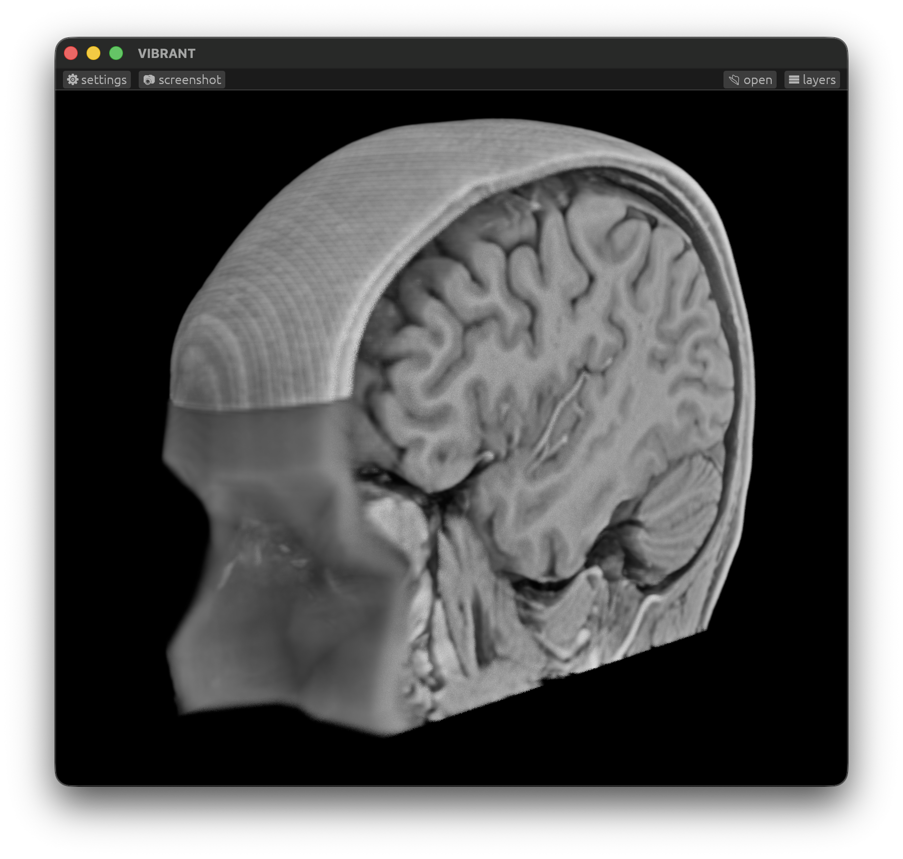
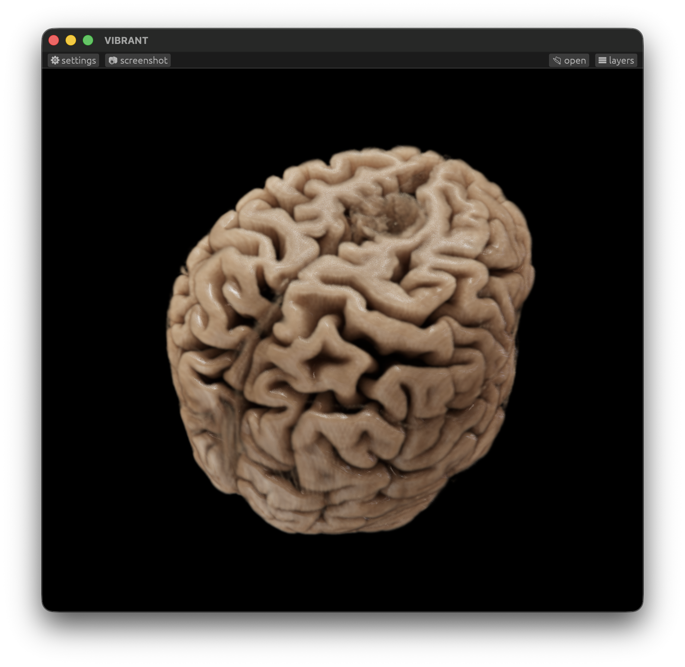

# VIBRANT Visualizing Brain Anatomy and Tractography

[VIBRANT](https://as-the-crow-flies.github.io/vibrant/) is a web-based cinematic anatomy and tractography tool.



## Getting Started

[VIBRANT](https://as-the-crow-flies.github.io/vibrant/) runs on the Web and natively on Windows, MacOS and Linux.

### Web Application

[VIBRANT](https://as-the-crow-flies.github.io/vibrant/) is built for the web, using WebGPU to power its cinematic rendering. It works best on Chrome.

### Running Natively

[VIBRANT](https://as-the-crow-flies.github.io/vibrant/) can run natively on all major platforms, including Windows, MacOS and Linux. 

It is built in Rust and therefore easy to compile for your system!

1. Install Rust

   https://rustup.rs/
2. Clone Git Repository 

   `git clone git@github.com:as-the-crow-flies/vibrant.git`
3. Navigate to the application folder

   `cd vibrant`
4. Build & Run the application

   `cargo run`

## Features

### Tractography Rendering

Load any number of `.tck` tract files to render them with vibrant colors and shadows.
Tracts can be colored using their tangent (default), a color per file, or using a `.tsf` tract scalar file.

#### Tract Scalar File Support

After loading `.tck` files, load any `.tsf` files with corresponding names to apply the scalar values to this tract, e.g. `test_AF_Left_fa.tsf` will be automatically applied to `AF_Left.tck`. A few sequential colormaps are supported.

| Tangent Coloring                  | Bundle Coloring                  | Tract Scalar File Coloring |
| --------------------------------- | -------------------------------- | -------------------------------- |
|  |   |   |

### NIfTI Volume Rendering

Load any scalar `.nii.gz` volume file to render it with given contrast and material. Load multiple NIfTI files to show ROIs or segmentations.

#### Masking

Load any `*mask*.nii.gz` NIfTI file with 'mask' anywhere in the name to import a mask. Then assign it to one or more volumes. Two types of masks are supported:

- Binary Masks - the classic mask we all know and love
- Signed Distance Field Masks - allowing for e.g. eroding the brain surface

| Volume Rendering    | Cinematic Rendering           |
| ------------------- | ----------------------------- |
|  |  |

### (Experimental) Environment Maps

By loading a `.exr` HDRI environment texture (e.g. from [Poly Haven](https://polyhaven.com/hdris/studio)), the application uses it as a light source to render your with colored lighting.

## Citing this Repository

If you use this software in your work, please cite our article:
```
Kraaijeveld, B., Jalba, A. C., Vilanova, A., & Chamberland, M. (2026). Real‐Time Rendering of Dynamic Line Sets using Voxel Ray Tracing. Computer Graphics Forum, e70372. https://doi.org/10.1111/cgf.70372
```

## Acknowledgements

This work was funded by the Dutch Research Council (NWO) grant number OCENW.M.22.352 awarded to Maxime Chamberland
