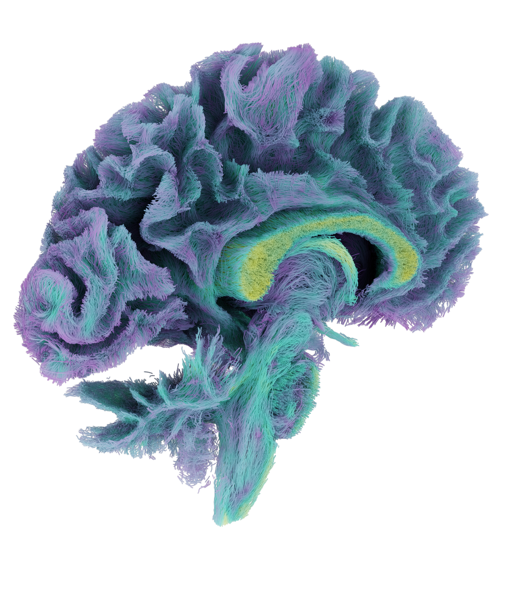

# VIBRANT — Cinematic Neuroanatomy & Tractography

<p align="center">
  <a href="https://as-the-crow-flies.github.io/vibrant/">
    
  </a>
</p>

<p align="center">
  <strong>Real-Time Cinematic Visualization of Neuroanatomy and Tractography — in your browser.</strong>
</p>

<p align="center">
  <a href="https://as-the-crow-flies.github.io/vibrant/">Launch the web app</a>
</p>

---

## What is VIBRANT?

VIBRANT is a tool for visualizing tractography and brain anatomy together in 3D. It takes the files you already work with — NIfTI volumes (`.nii` / `.nii.gz`), tractograms (`.tck`), and track scalar files (`.tsf`) — and renders them with physically based lighting at interactive frame rates.

- **Physically based.** Light, shadows, and materials follow real-world optics.
- **Interactive.** Rotate, slice, and adjust lighting and materials in real time.
- **Nothing leaves your computer.** Files are opened and rendered locally.
- **Publication output.** One-click screenshot with a transparent background.

<p align="center">
  
</p>

---

## What you can do with it

- **Bring a whole study into one scene.** Load any number of volumes and bundles at once — anatomical scans, ROIs, segmentations, tractograms — and view them together under consistent lighting.
- **Make bundles readable.** Colour streamlines by tangent direction, per bundle, or by a track scalar such as FA, and let the cinematic lighting reveal the 3D structure.
- **Look inside.** Slice the scene with orthogonal or spherical cut planes and restrict volumes to a region of interest with NIfTI masks.
- **Light it like a photograph.** Use lighting to reveal the depth and shape of neuroanatomy and tractography.
- **Export figures.** Grab a transparent-background screenshot at any point for slides, papers, and posters.

---

## Features

### Volumes

Load scalar NIfTI volumes for direct volume rendering. A histogram-based transfer-function editor controls which intensities are visible and how they are coloured, while environment lighting and material settings highlight the three-dimensionality of the data.

| Standard volume rendering | With cinematic lighting |
| --- | --- |
|  |  |

### Tractography

Load one or many `.tck` tractograms and render them as lit tubes with shadows and ambient occlusion, so crossing and fanning geometry stays legible. Each bundle can be shown, hidden, coloured, and sliced on its own.

Streamlines can be coloured by **tangent direction**, by a **fixed colour per bundle**, or by a **track scalar** — drop a `.tsf` next to its `.tck` and VIBRANT pairs them automatically and maps the values through a sequential colormap.

| Tangent direction | Per-bundle colour | Track scalar (`.tsf`) |
| --- | --- | --- |
|  |  |  |

Two render modes control how bundles sit against the volume: **Combined** lights and composites them with the volume so the two occlude one another, while **Overlay** draws the bundles unoccluded on top for a clear, see-through view.

| Combined | Overlay |
| --- | --- |
|  |  |

### Slicing & masking

Explore interior structure with orthogonal (axial / sagittal / coronal) clip planes and a spherical cutaway. Slicing can apply to the volumes alone or to the streamlines as well.

Any NIfTI whose filename contains `mask` is loaded as a mask and can be assigned to one or more volumes to restrict them to a region of interest. Both binary and signed-distance masks are supported, and masks can be inverted.

<p align="center">
  
</p>

### Lighting & materials

Lighting comes from an image-based environment map. A few maps are built in, and you can load your own `.exr` (for example from [Poly Haven](https://polyhaven.com/)); the light direction is draggable directly in the view. Adjusting the environment and the volume's surface response changes the entire mood of a figure.

| Hangar environment map | Ferndale environment map |
| --- | --- |
|  |  |

---

## Getting started

### Web App (recommended)

VIBRANT runs entirely in the browser — get started by clicking the link:

**https://as-the-crow-flies.github.io/vibrant/**

The web app needs a browser with **WebGPU** support (recent Chrome, Edge, or Safari; Firefox with WebGPU enabled).

### Running on the desktop

VIBRANT also runs natively on Windows, macOS, and Linux. It is easy to build it yourself using the Rust Toolchain.

1. Install Rust: <https://rustup.rs/>
2. Build and run:

   ```bash
   git clone git@github.com:as-the-crow-flies/vibrant.git
   cd vibrant
   cargo run --release
   ```

---

## Citation

If you use VIBRANT in academic work, please cite [our paper](https://doi.org/10.1111/cgf.70372):

```bibtex
@article{https://doi.org/10.1111/cgf.70372,
  author  = {Kraaijeveld, B. and Jalba, A.C. and Vilanova, A. and Chamberland, M.},
  title   = {Real-Time Rendering of Dynamic Line Sets using Voxel Ray Tracing},
  journal = {Computer Graphics Forum},
  volume  = {n/a},
  number  = {n/a},
  pages   = {e70372},
  doi     = {https://doi.org/10.1111/cgf.70372},
  url     = {https://onlinelibrary.wiley.com/doi/abs/10.1111/cgf.70372},
  eprint  = {https://onlinelibrary.wiley.com/doi/pdf/10.1111/cgf.70372}
}
```

## Acknowledgements

This work was funded by the Dutch Research Council (NWO), grant **OCENW.M.22.352**, awarded to Maxime Chamberland.
